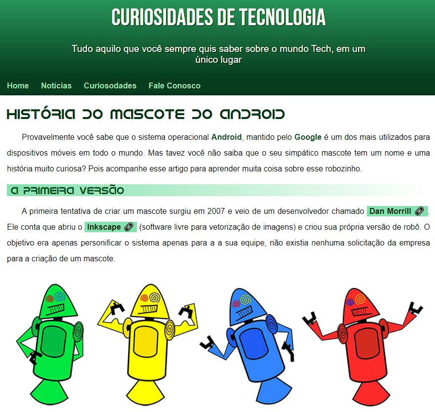

<h1 align="center"> Desafio Curso em vídeo </h1>
 

## 💻 Projeto

Projeto desenvolvido no curso de html e css do curso em vídeo. Ministrado pelo professor Gustavo Guanabara. 

## 🚀 Tecnologias

Esse projeto foi desenvolvido com as seguintes tecnologias:

- HTML e CSS
- Git e Github

## 🔖 Layout

  

## &#x1F517; Link:
Link do projeto pronto: https://jeffbveiga.github.io/Desafio-Curso-em-video/ 
